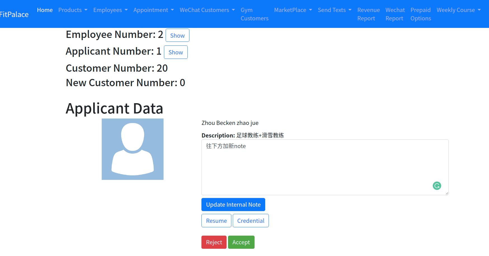

#### Scheduling App for Wechat Users

* PostgreSQL
* API-only RoR app
* Heroku backend server
* Wechat Oauth
* Google Cloud Service(storage, geo-location)
* Vue-js front-end
* 3rd party payment processing(OTT Pay)

## index page of created by designer

* customer could choose one of the 8 sports
* workout is the only working feature
* the other 7 sports would trigger a ballot event to collects user data to help the client to determine which sport to be added next

  
  
  

* Customer choose date(with or without calender), start time(end time auto generated), address(use current location/enter manually)
* Address then geo-located using Google Cloud Service
* database would then filter out all the available coach within 5km from user location

* customer view of the appointments list

* admin can manage current employee, suspend/activate employee working status
* admin can create employee notes for internal use(with auto-generate timestamp)
* change employee profile pic(override the original one that's captured from wechat)
* inspect the employee's certificate/resume which was saved in Google Cloud Storage

* admin can accept/reject applicant's application
* admin can view the certificate/resume uploaded by the applicant
* admin can add note to each applicant(with auto-generate timestamp)